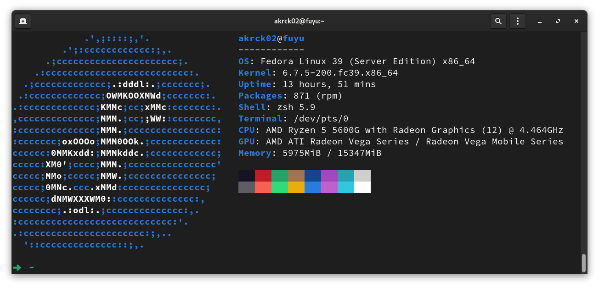

# Homelab 🖥️

Hi there! A couple years ago I started a project called [NAS-Project](https://github.com/akrck02/NAS-Project). This was the first attemp to setup an old laptop as a home server / NAS with linux. It turned out very well but the good old Acer Aspire was not a very reliable companion.

So, I decided to browse over the internet and search some people's propper builds and I discovered the amazing world of homelabs, self hosting and container based rigs.

That's why in January 2023 I build a machine capable of running VM's, dockerized services and with enough storage to serve as a propper local network attach storage for me and my family with the following specs.

## Specs 🤓

| CPU  | RAM | STORAGE |
|--|--|--|
|Ryzen 5 5600G 4.4GHz | 16GB DDR4 3200MHz | 500GB NVME / 4TB HDD / 4TB HDD |

## Is this a remake (?) 
I learned a lot about deploying applications and sharing and serving data, but later on I decided to switch from a regular [Ubuntu](https://releases.ubuntu.com/) to [Fedora server](https://releases.ubuntu.com/jammy/).

I really like fedora's simplistic and stable approach to the linux OS, I use it in all my computers to work as a software developer and I also started using it as a gaming OS in a separate Nvme on my main rig, so I was tempted by the idea of changing the OS from my server to a much stable and server focused one (I was using regular ubuntu at first instead of ubuntu server). 

This decision was also boosted by the power and resource consumption, so I cleared my head and decided to redo my server configurations once again.

[Installing OS](./docs/1.OS.md)

[SSH](./docs/2.ssh.md)

[ZSH](./docs/3.zsh.md)

[Docker](./docs/4.docker.md)

