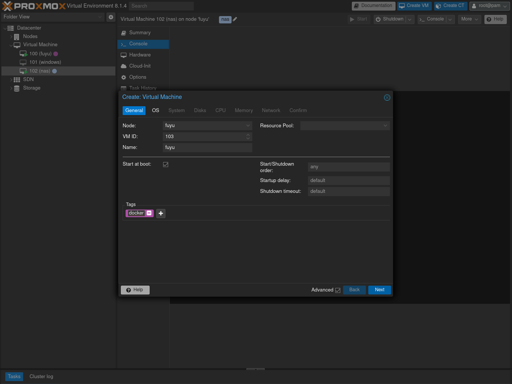
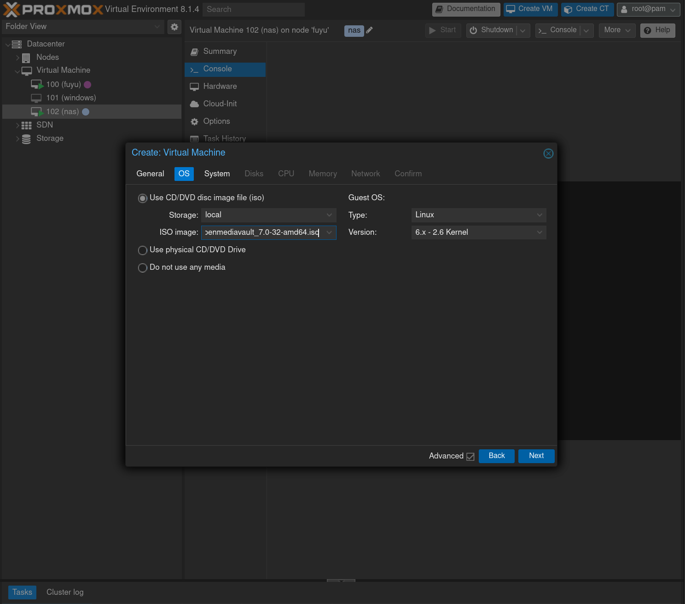
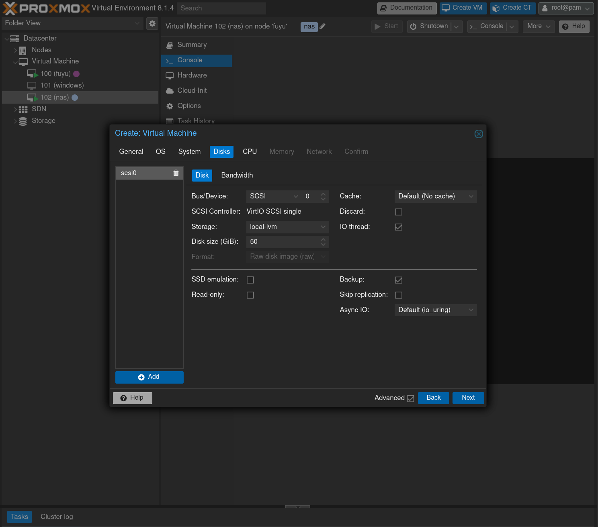
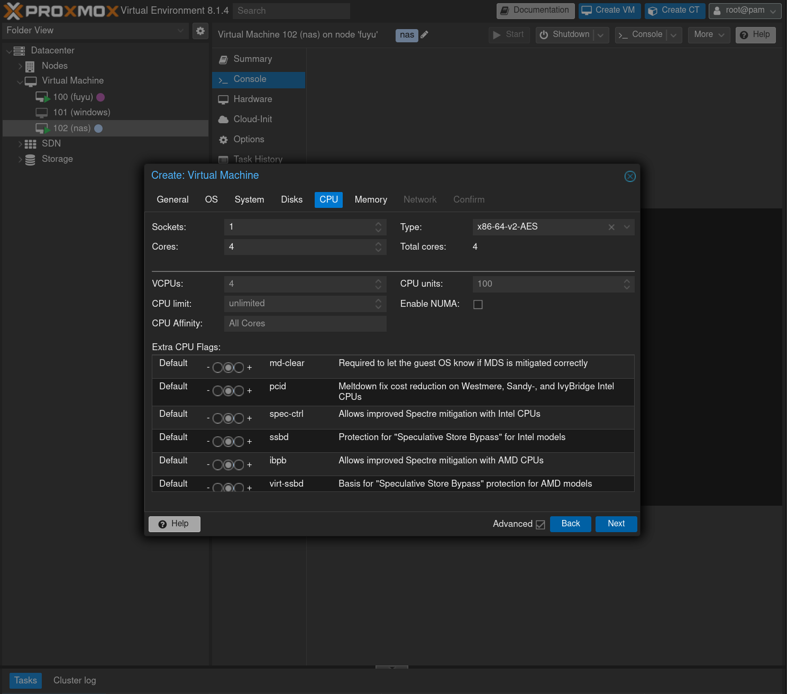
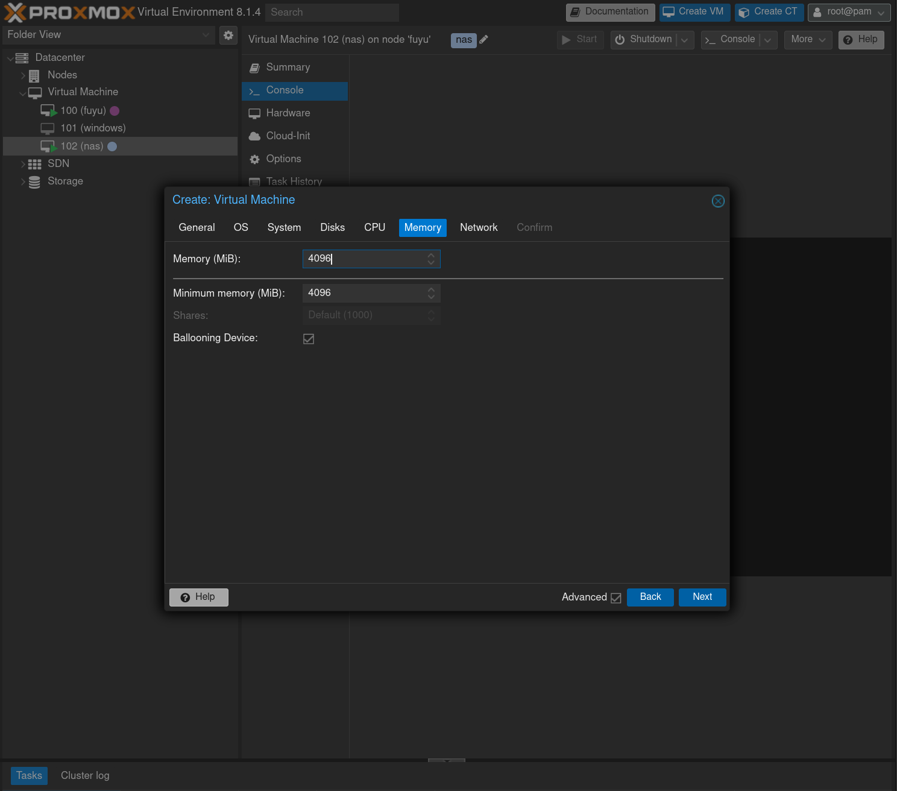

# Proxmox

In order to keep NAS capabilities in the homelab, I decided to install proxmox as hypervisor and then create a VM to serve files and another with our fedora server.

OpenmediaVault is a NAS server OS that makes easy to create RAID with your disks and share with SMB and NFS.

Let's create an openmediavault instance with 4GB of RAM and 4 threads.

Let's add 50GB of NVMe disk to boot openmediavault.

In order to add our physical disk to the new VM, we need to ssh into the proxmox and execute the following commands.

List the disk ids:
> ls -l /dev/disk/by-id

For each disk add it to the VM:
> qm set [VM_ID] -scsi[SEQUENTIAL_NUMBER] /dev/disk/by-id/[FULL_ID_OF_DISK]

# Setting up fedora server

Let's create an openmediavault instance with 12GB of RAM and 8 threads and follow the [fedora server installing guide](./1.OS.md).

[Next ➡️](./1.OS.md)
