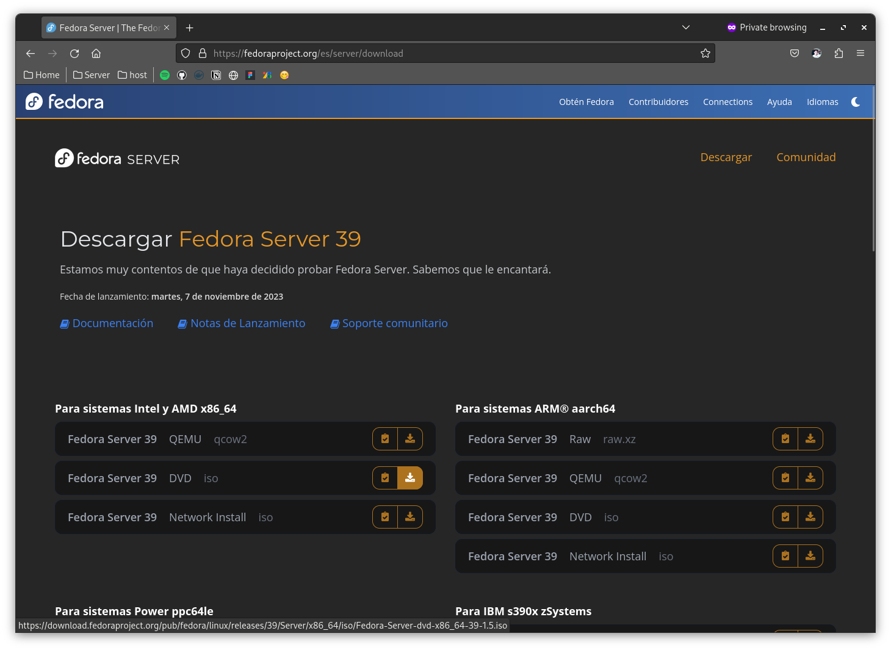
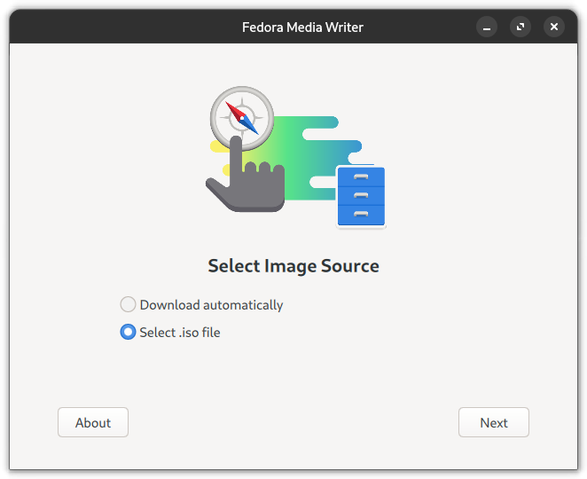
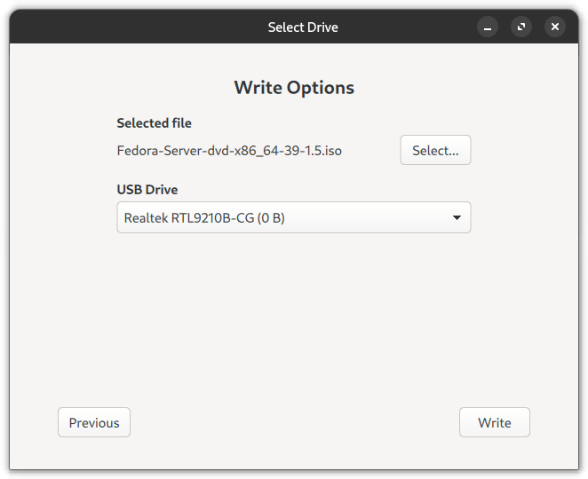
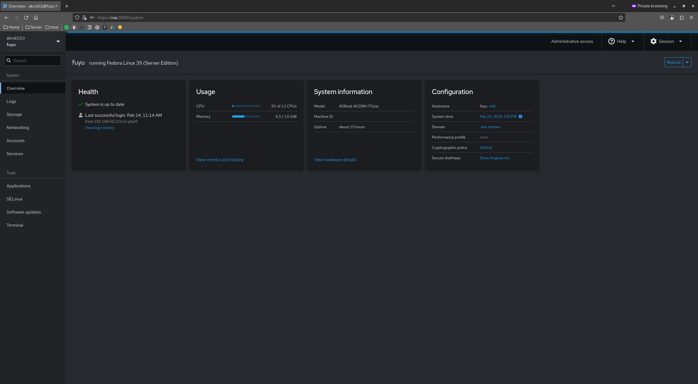
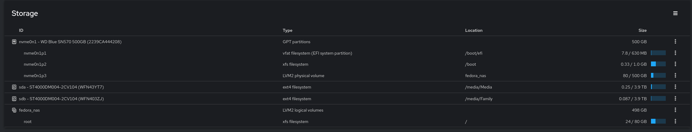

# Installing the OS 

To install fedora server 39 go to the [official fedora website](https://fedoraproject.org/es/server/download) and download the latest ISO.

I personally use fedora media writer to make a live USB,
download it from the website and follow the steps.

Once the live USB is done, go to the BIOS / UEFI on your motherboard and change the boot order to let the USB execute, save settings and boot the server.

The installer will show, select the root user (if any), the regular user (must have), language, keyboard layout and partitions 
where the OS will be, in my case I selected the 500GB NVME drive, english language and spanish keyboard layout.

Follow the steps and reboot unplugging the USB.

> ✨ Congratulations you've Fedora Server installed! ✨ 

This version of fedora is server focused so you can accessa server dashboard with usefull information and actions in http://yourserver:9090/

Even the disk data is here:

[⬅️ Last](../README.md) 
&nbsp;&nbsp;&nbsp;&nbsp;|&nbsp;&nbsp;&nbsp;&nbsp;
[Next ➡️](./2.zsh.md)
