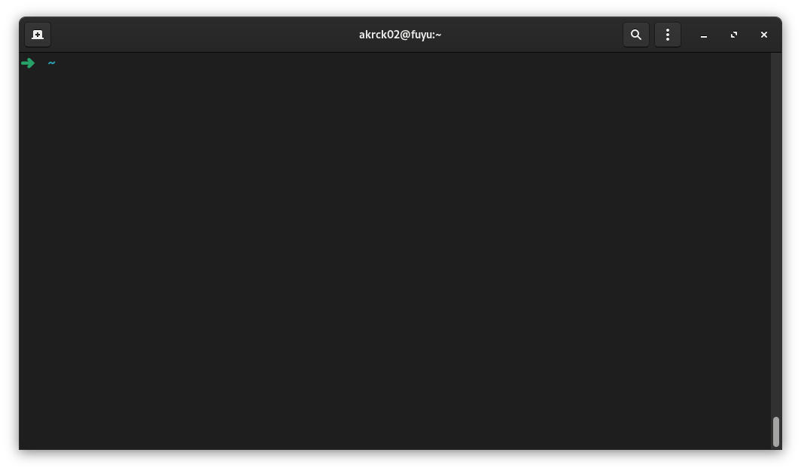

# Connecting via ssh

This server will not have attach a display, only a network and power cable, so we have to access it from outside, luckily fedora server has SSH enabled by default, so you only have to know your IP address.

you can check it with 
```shell
ip a
```

and then connect with 
```shell
ssh youruser@yourserver
```

the ssh cli you will ask you if you want to accept leaving a fingerprint and then open a terminal connected to your server



[⬅️ Last](./1.OS.md) 
&nbsp;&nbsp;&nbsp;&nbsp;|&nbsp;&nbsp;&nbsp;&nbsp;
[Next ➡️](./3.zsh.md)

