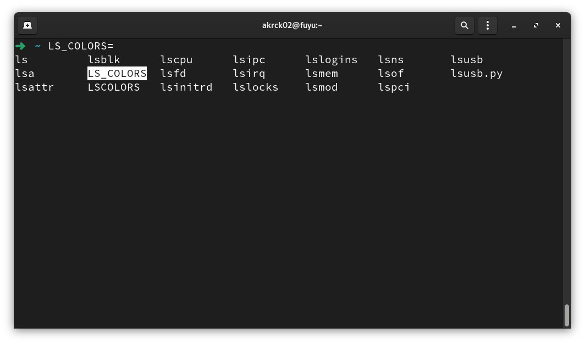
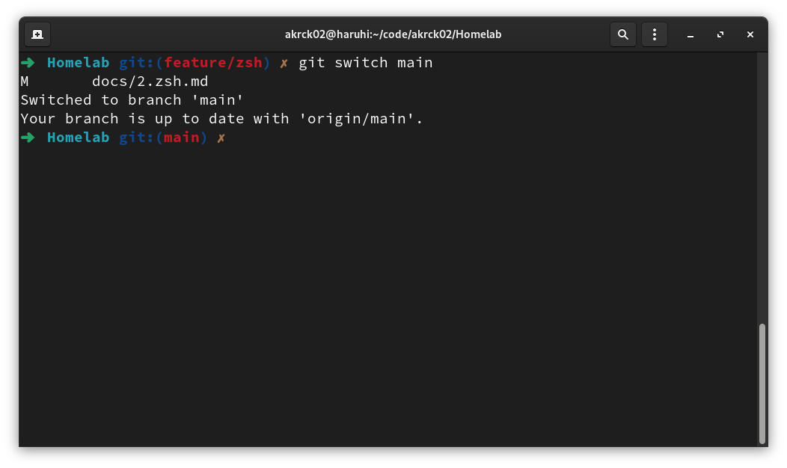

# Zsh 

Zsh is a very good command interperter like bash, but with some quality of life features that make it very appealing.

Recently a coworked talk me about this interpreter and tested it so I decided to add it as default command shell to my computers and of course to this server.

To install zsh a use th following command

```shell
sudo dnf install zsh
```

Once it is installed you can try it with 
```shell
zsh
```

You can set the shell as default for your user: 
```shell
chsh -s $(which zsh)
```

and for root: 
```shell
sudo chsh -s $(which zsh)
```

## ✨ Making it pretty ✨

Zsh has a huge plugin and theme ecosystem, so you can customize it however you want.

Oh-my-zsh is a popular framework to customize zsh, you can install with this command:


```shell
sh -c "$(curl -fsSL https://raw.github.com/ohmyzsh/ohmyzsh/master/tools/install.sh)"
```

A configuration menu will appear for you to change every setting you like and then the zsh cli will show up.



Zsh will show you now things as the current branch if you're in a git project.



[⬅️ Last](./1.OS.md) 
&nbsp;&nbsp;&nbsp;&nbsp;|&nbsp;&nbsp;&nbsp;&nbsp;
[Next ➡️](./3..md)

