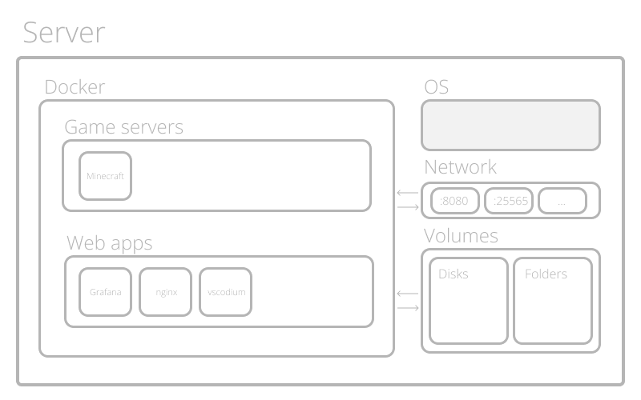
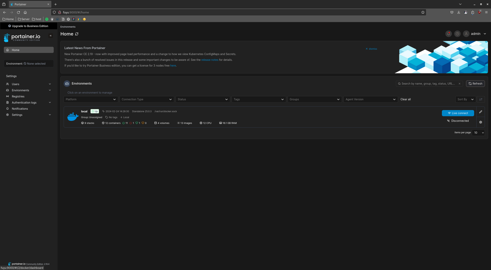
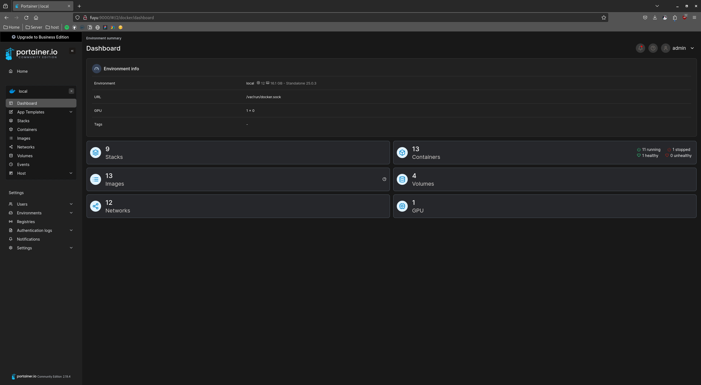
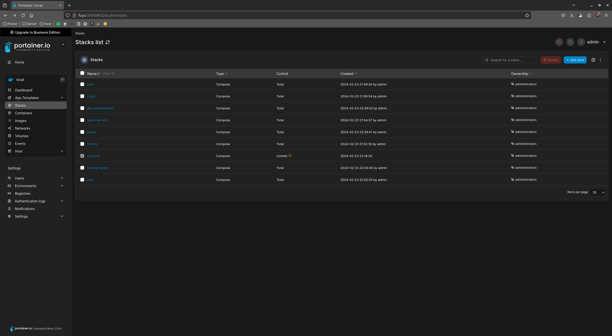
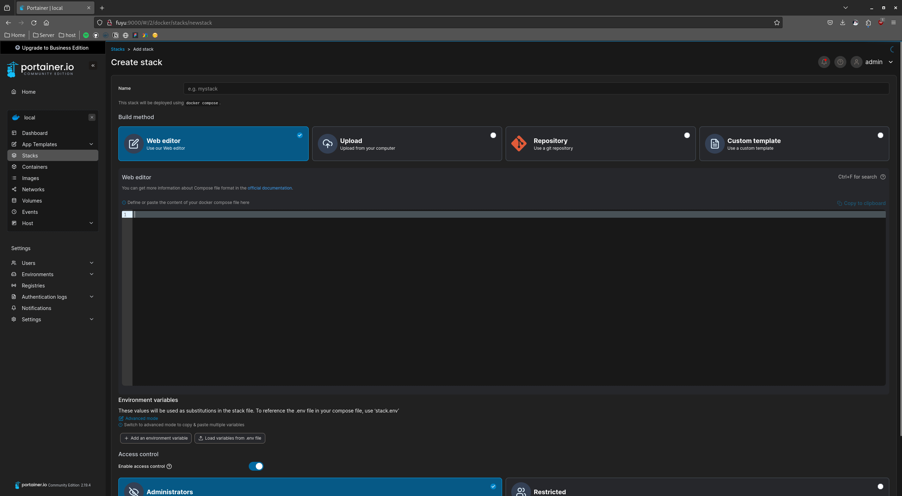
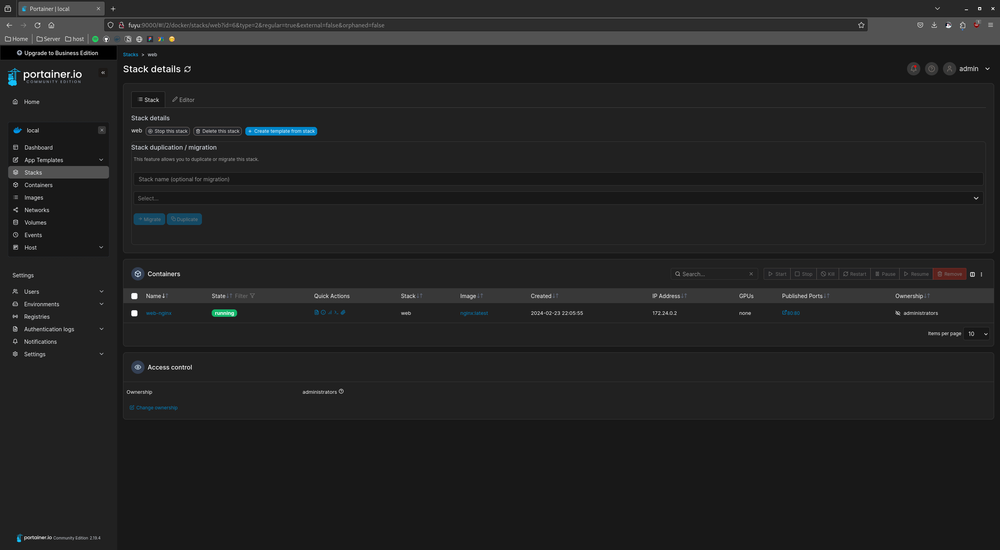
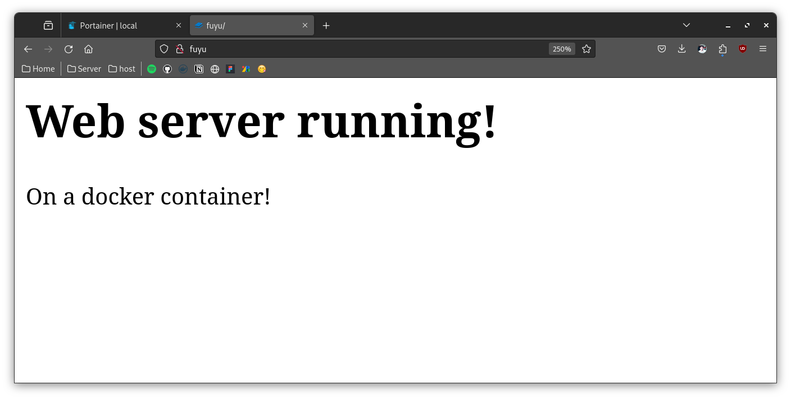

# Why docker? 

Containers allow each service to run in their own isolated environment, making them reproducible and scalable.

Here's a diagram of how docker containers work:



The containers only use the system resources you give them, if you declare a container port to link with a native port no other ports will be opened.

If you declare a volume (a disk or directory) to be used by a container, it can't access any of your other disks or folders.

## Installing docker

Add repositories to dnf

```shell
sudo dnf -y install dnf-plugins-core
sudo dnf config-manager --add-repo https://download.docker.com/linux/fedora/docker-ce.repo
```

Install docker engine
```shell
sudo dnf install docker-ce docker-ce-cli containerd.io docker-buildx-plugin docker-compose-plugin
```

Start docker service
```shell 
sudo systemctl start docker
```

Add user to docker group
```shell
sudo usermod -aG docker $USER
```

Set docker to start on boot
```shell
sudo systemctl enable docker.service
sudo systemctl enable containerd.service
```

## Docker compose

You can run docker containers and pass the configurations to the docker command, but this method it's not easily versionable.

I personally use git to manage my docker configurations, to do so docker compose is a very good companion that manages containers on isolated stacks making the architecture more secure and understandable.

### How do I declare a docker service?

Declaring docker stacks and services it's preatty simple, this is an example of an NGINX service that runs a web server on port 80 serving any file on $USER/web folder

```yaml
# docker-compose.yaml
version: '3'

services:
  nginx:
    image: nginx:latest
    container_name: web-nginx
    ports:
      - "80:80"
    volumes:
      - /home/myuser/web:/usr/share/nginx/html
    restart: always
```

to start this container type the following command on the directory that has the file
```shell
docker compose up
```

to stop it use this
```shell
docker compose down
```

## Portainer

I really like docker compose but deploying and monitoring apps from cli is less convinient that a well made webUI. That's why I install Portainer on this server.

Portainer can be installed in a docker container (How cool is that?), this is the docker-compose.yaml file to use it.

```yaml
version: '3'

services:
  portainer:
    image: portainer/portainer-ce:latest
    container_name: portainer
    restart: unless-stopped
    security_opt:
      - no-new-privileges:true
    volumes:
      - /etc/localtime:/etc/localtime:ro
      - /var/run/docker.sock:/var/run/docker.sock:ro
      - ./portainer-data:/data
    ports:
      - 9000:9000
```

This will open the port 9000 for you to use the web app. It will ask you to add a user and password and then show the dashboard. But before accessing the UI let's create a service to start portainer on startup.

Let's create a file called **/etc/systemd/system/portainer.service** with the following content
```text
# /etc/systemd/system/portainer.service

[Unit]
Description=Portainer Service
Requires=docker.service
After=docker.service

[Service]
Type=oneshot
RemainAfterExit=yes
WorkingDirectory=/home/akrck02/services/portainer
ExecStart=docker compose up -d
ExecStop=docker compose down
TimeoutStartSec=0

[Install]
WantedBy=multi-user.target
```

Enable and start the service
```shell
sudo systemctl enable portainer.service
sudo systemctl start portainer.service
```

Ready to go! now we can access the UI everytime the server boots!



You can set multiple environments but the local one is your current docker instalation. if you enter on the local environment you will see the stacks, containers, networks images and volumes deployed.



If you enter on the stacks section, you can see the deployed stacks or add a new one.



I already have stacks deployed because I'm doing this docs after the instalation of al my services, you will have an empty space. Clicking the add stack button will lead you to the following creation view.



Here you can upload the docker compose files and deploy!
We will test the web server here.



Let's add an index.html to the server $USER/web folder and access http://myserver

```html
<html>
    <body>
        <h1>Web server running!</h1>
        <p>On a docker container!</p>
    </body>
</html>
```

