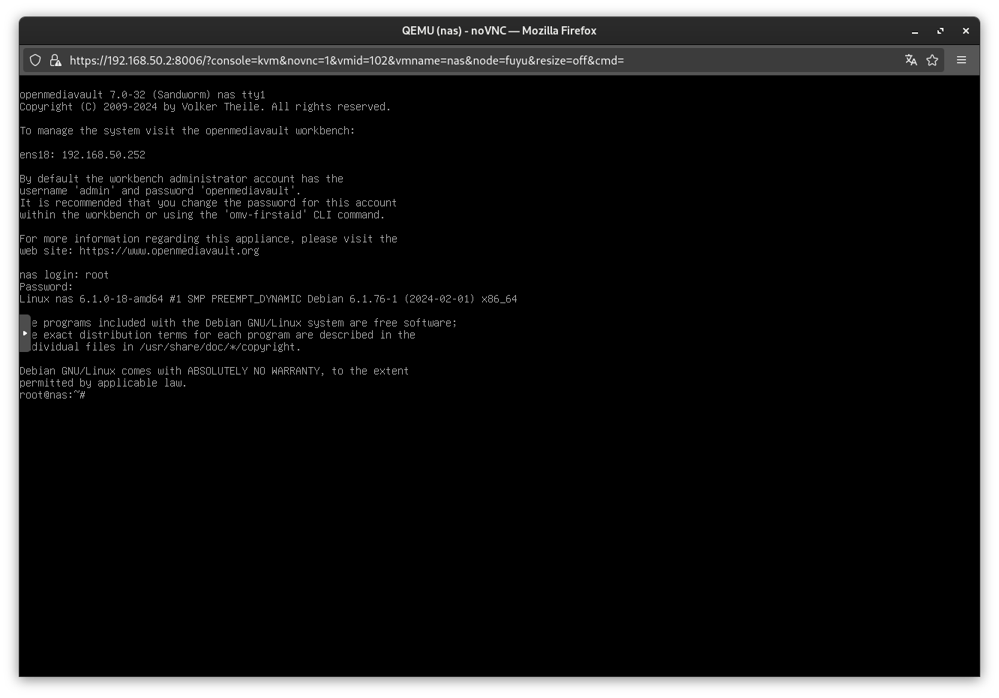
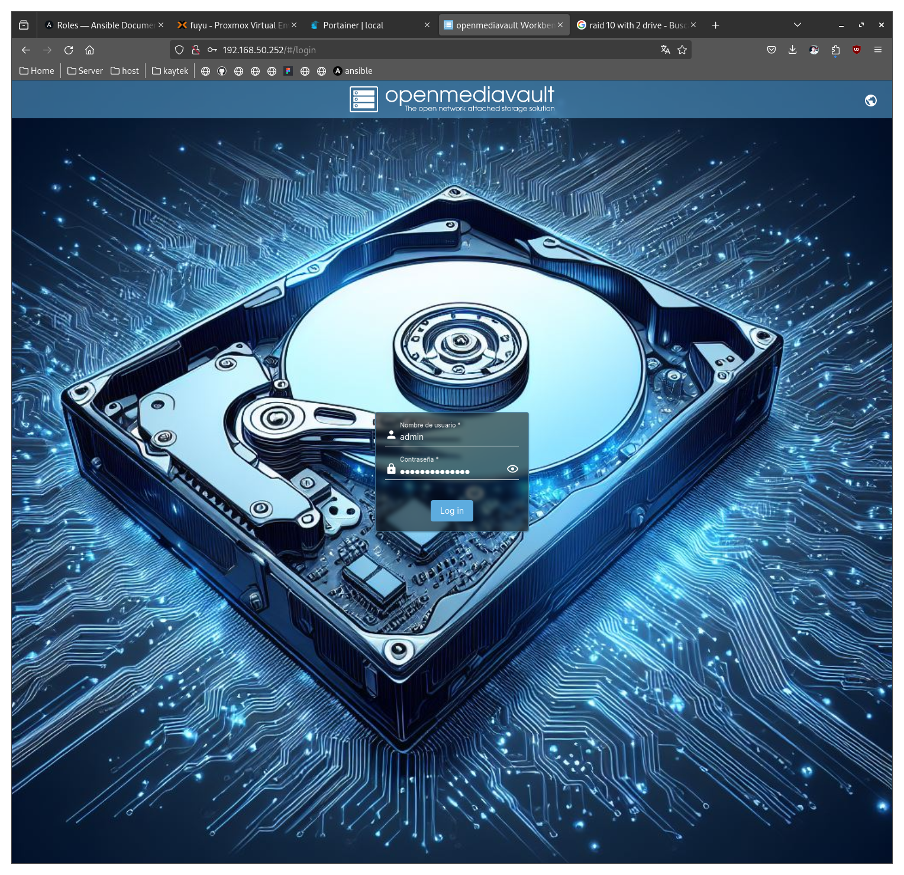
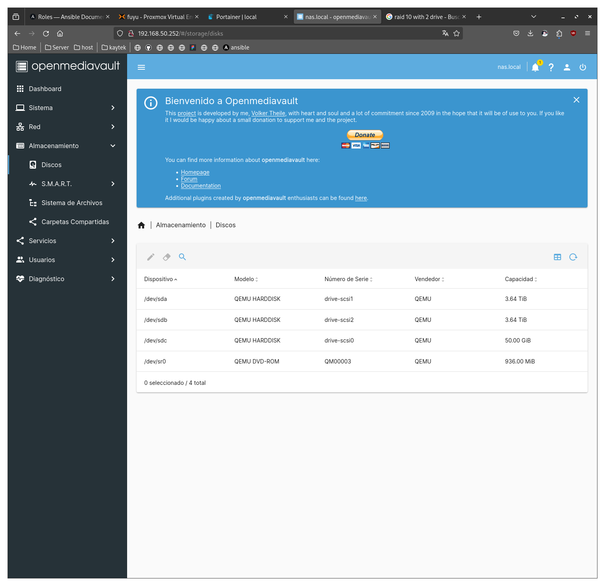
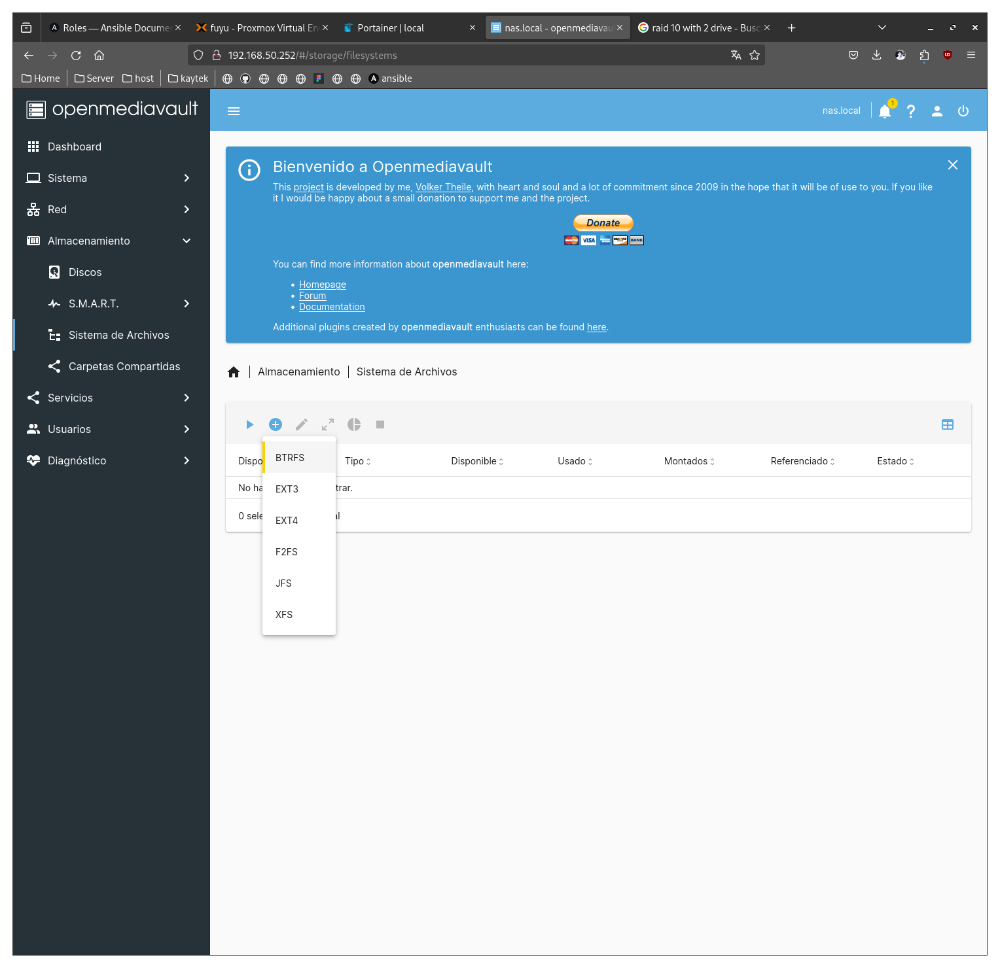
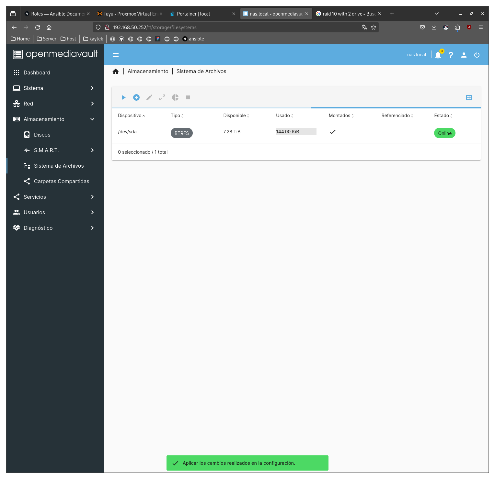
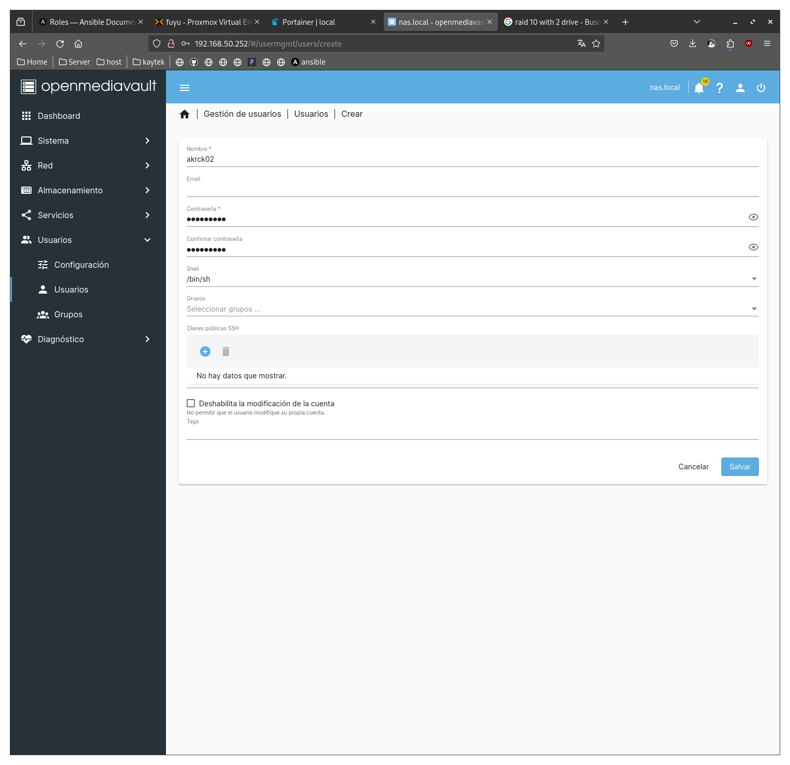
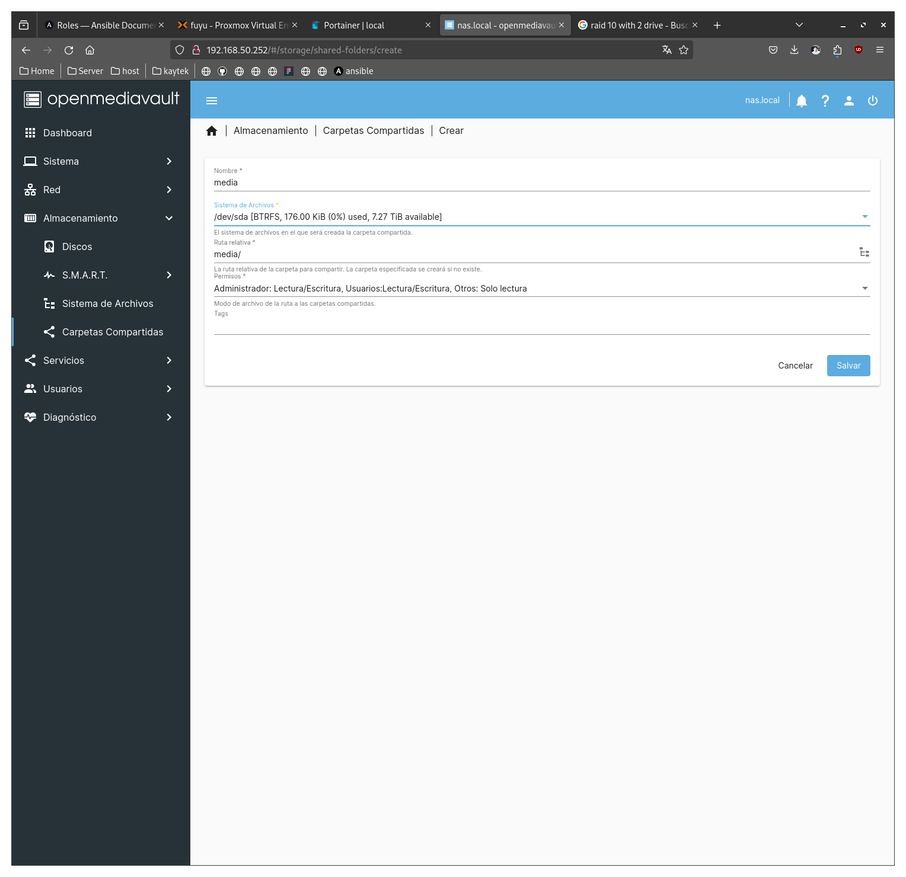

## Setting up OpenMediaVault

Installing process is easy, select your language, root user password and wait.



this will open the 80 port on the VM ip (192.168.50.252 in my case), so we can setup the NAS on the webUI. 

Default login is ```admin/openmediavault```



We can see the disks here:



Let's setup a BTRFS RAID 1:





## Creating a user

Go to Users > Users



## Creating SMB share

Go to Services > SMB/CIFS and enable the service


Create a share to be used in SMB/CIFS/NSF



Share the media folder.


